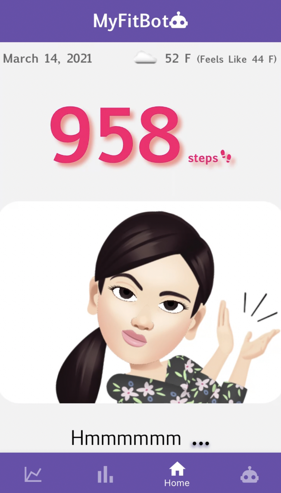
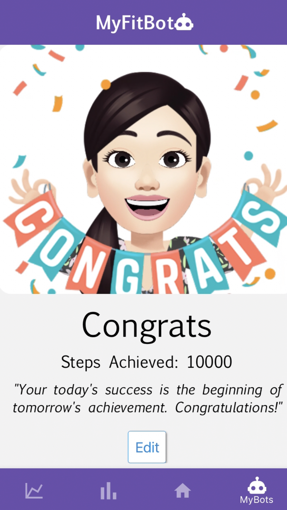
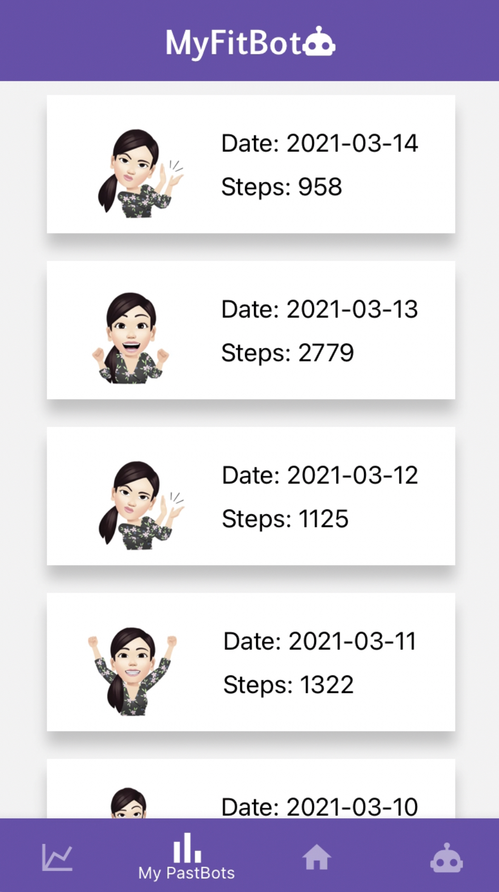
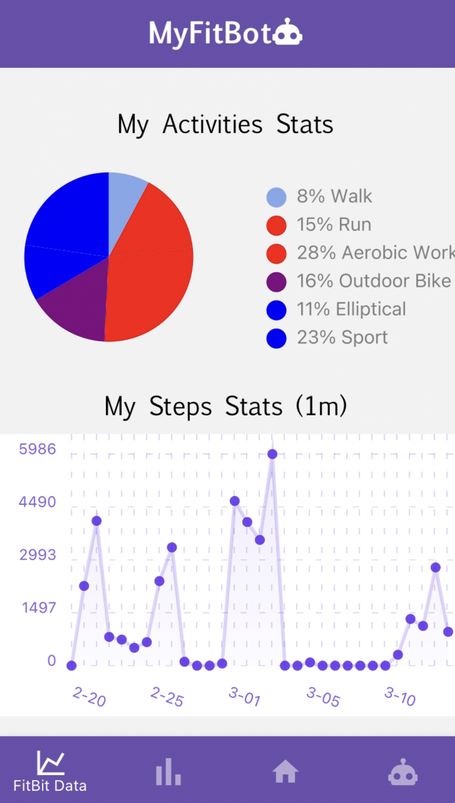

# MyFitBot

Built in just four days for the Stackathon project. 
 Mobile app for Fitbit users that creates extra motivation to increase steps through interactive avatar.
 Integrated Fitbit data to React Native app, allowing the avatar to dynamically change moods based on step count.
  Configured Firebase/Cloud Firestore to store and manage user preferences on avatar’s setting and step goals.

## Tech Stack
React Native on Expo, Firebase/Cloud Firestore, Fitbit Web API, React Native Chart Kit

## Overview

#### Home Page - Step count with current avatar image

#### MyBots Page - List of avatars with steps goal & motivational phrases (can edit)

#### My Past Bots Page - Past achievements with avatar image

#### FitBit Data Page - Charts representing activities type & past step counts

